# Power BI Portfolio Project: Toronto Healthcare Outbreaks

## Project Overview

This project analyzes outbreaks in Toronto healthcare institutions using public open data from the City of Toronto.

I built an operational Power BI dashboard to monitor active and closed outbreaks, analyze outbreak trends over time, compare healthcare settings and outbreak types, and review causative agents such as COVID-19.

The goal of this project is to demonstrate practical Power BI skills, including Power Query, data modelling, DAX measures, KPI design, interactive filtering, and dashboard storytelling.

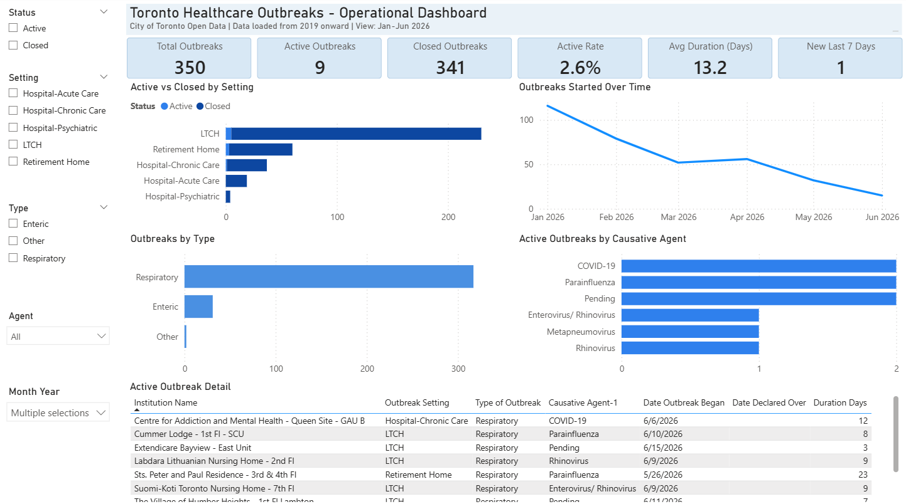

---

## Business Questions

This dashboard was designed to answer the following questions:

1. How many outbreaks are currently active?
2. What percentage of outbreaks are active versus closed?
3. Which healthcare settings have the highest number of outbreaks?
4. How have outbreaks changed over time?
5. Which outbreak types are most common?
6. Which causative agents are associated with active outbreaks?
7. Which active outbreaks have been open the longest?
8. How has the COVID-19 outbreak trend changed across recent years?

---

## Tools Used

* Power BI Desktop
* Power Query
* DAX
* Calendar table
* City of Toronto Open Data
* CKAN open data platform
* GitHub documentation

---

## Dataset

**Dataset:** Outbreaks in Toronto Healthcare Institutions
**Source:** City of Toronto Open Data Portal
**Dataset link:** https://open.toronto.ca/dataset/outbreaks-in-toronto-healthcare-institutions/
**Open data platform:** CKAN
**CKAN link:** https://ckan.org/

The source files follow the naming convention:

```text
ob_report_YYYY.csv
```

where `YYYY` represents the year of the outbreak data.

For this project, I used files from 2019 onward to focus on COVID-19 and recent outbreak patterns.

---

## Key Dashboard Features

* KPI cards for total outbreaks, active outbreaks, closed outbreaks, active rate, average duration, and new outbreaks in the last seven days
* Interactive slicers for Month Year, status, setting, outbreak type, and causative agent
* Historical trend analysis from 2019 onward
* Jan-Jun 2026 operational view
* COVID-19 filtered trend analysis
* Active versus closed outbreaks by healthcare setting
* Outbreak breakdown by type
* Active outbreaks by causative agent
* Active outbreak detail table sorted by duration

---

## Key Insights

The dashboard showed several important patterns:

* Outbreaks show a seasonal pattern, with peaks commonly occurring around winter months, especially December or January.
* The last three years show similar winter peak patterns.
* In the Jan-Jun 2026 view, outbreaks decreased after January and remained lower through spring and early summer.
* COVID-19 remained an important causative agent in the Jan-Jun 2026 operational view.
* When filtering to COVID-19 only, peak outbreak counts decreased from 131 in December 2023, to 73 in December 2024, and to 33 in January 2026.
* Respiratory outbreaks represented the largest outbreak type in the selected Jan-Jun 2026 period.
* Long-term care homes had the highest number of outbreaks in the selected Jan-Jun 2026 period.

---

## Dashboard Screenshots

### Outbreaks Started Over Time - 2019 onward

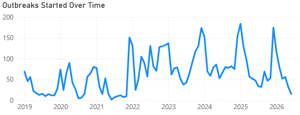

### Outbreaks Started Over Time - Jan-Jun 2026

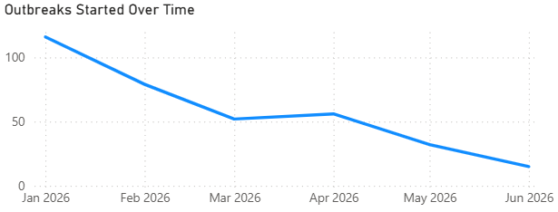

### COVID-19 Outbreaks Started Over Time

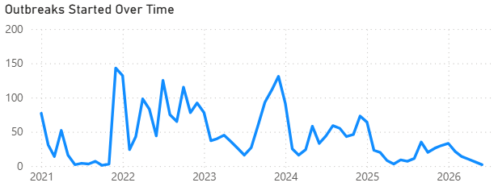

### Active vs Closed by Setting

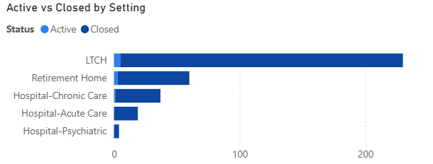

### Outbreaks by Type

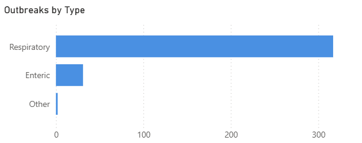

### Active Outbreaks by Causative Agent

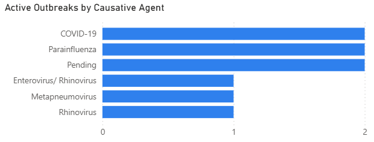

### Active Outbreak Detail Table

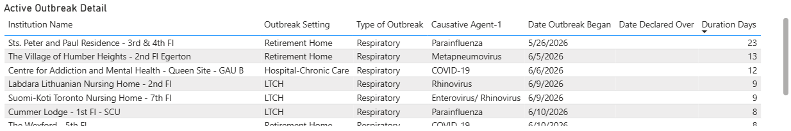

---

## Development Screenshots

### Data Model

The model uses a combined outbreak table connected to a Calendar table for time-based analysis.

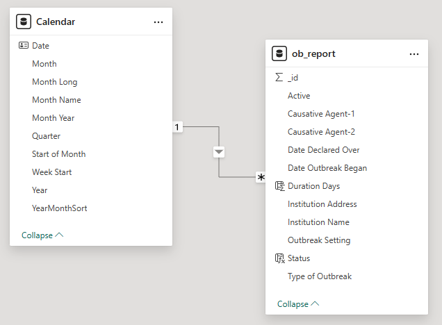

### Power Query File Combination

Yearly CSV files were loaded from a folder, filtered to include outbreak report files, combined into one table, and transformed by setting the appropriate column data types.

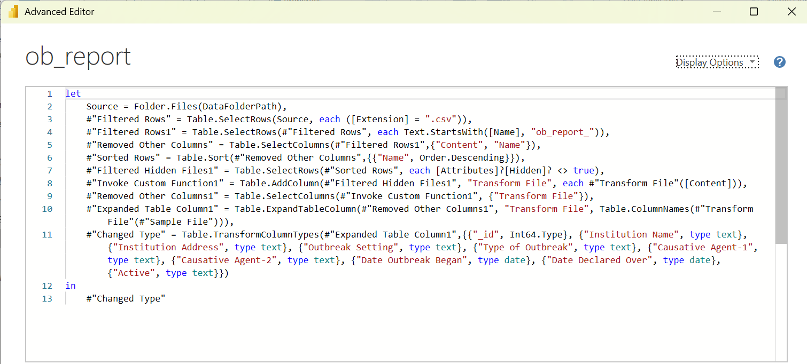

### DAX Measures

Key measures were organized in a dedicated `_Measures` table.

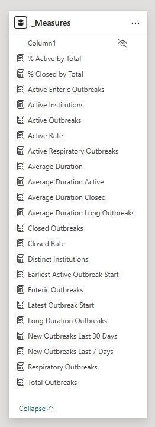

---

## Repository Structure

```text
powerbi-toronto-healthcare-outbreaks/
│
├── README.md
│
├── case-study/
│   └── PowerBI_Toronto_Healthcare_Outbreaks_Case_Study.pdf
│
├── data/
│   ├── raw/
│   │   ├── ob_report_2019.csv
│   │   ├── ob_report_2020.csv
│   │   ├── ob_report_2021.csv
│   │   ├── ob_report_2022.csv
│   │   ├── ob_report_2023.csv
│   │   ├── ob_report_2024.csv
│   │   ├── ob_report_2025.csv
│   │   └── ob_report_2026.csv
│   │
│   └── README.md
│
├── docs/
│   ├── data-preparation.md
│   ├── data-model.md
│   ├── dax-measures.md
│   ├── responsible-ai-use.md
│   └── future-improvements.md
│
├── powerbi/
│   └── Toronto_Healthcare_Outbreaks.pbix
│
└── screenshots/
    ├── dashboard/
    └── development/
```

---

## How to Open the Power BI Report

1. Download or clone this repository.
2. Open the file below in Power BI Desktop:

```text
powerbi/Toronto_Healthcare_Outbreaks.pbix
```

3. If you want to refresh the report, update the `DataFolderPath` parameter in Power BI Desktop so it points to your local copy of the `data/raw` folder.

Example:

```text
C:\your-folder\powerbi-toronto-healthcare-outbreaks\data\raw
```

4. Refresh the report.

---

## Detailed Documentation

More details are available in the `docs/` folder:

* [Data Preparation](docs/data-preparation.md)
* [Data Model](docs/data-model.md)
* [DAX Measures](docs/dax-measures.md)
* [Responsible Use of AI](docs/responsible-ai-use.md)
* [Future Improvements](docs/future-improvements.md)

---

## Full Case Study

A full PDF case study is available here:

[Power BI Toronto Healthcare Outbreaks Case Study](case-study/PowerBI_Toronto_Healthcare_Outbreaks_Case_Study.pdf)

---

## Notes

This project uses public open data from the City of Toronto. The purpose of this repository is to demonstrate Power BI dashboard development, data preparation, data modelling, DAX measures, and analytical storytelling for a portfolio project.
